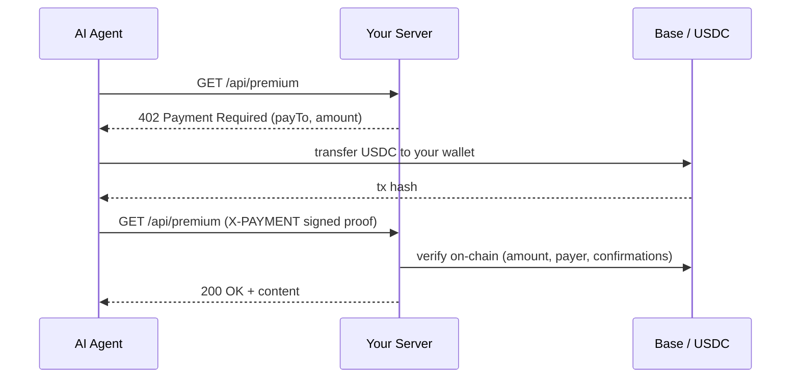

<div align="center">

# ◢ AgentPay

### The drop-in payment rail for AI agents — open source.

Let autonomous agents pay your API in **USDC** over the open **[x402](https://www.x402.org)** standard, with one line of code. Non-custodial: money settles straight to your wallet. AgentPay never touches it.

[](LICENSE)
[](https://www.typescriptlang.org/)
[](https://www.x402.org)
[](#tested--hardened)
[](#contributing)
[](https://github.com/ANVEAI/agentpay/stargazers)

[Quickstart](#quickstart-60-seconds) · [How it works](#how-it-works) · [The agent side](#the-agent-side) · [Self-host](#self-host) · [Security](SECURITY.md)

</div>

---

AI agents are starting to buy things: APIs, data, compute, actions. **AgentPay is the easiest way to charge them.** Drop one line into your server, and an unpaid request gets an HTTP `402` with a payment requirement; the agent pays USDC and retries; the money lands in your wallet. Think Stripe, but for agents, and **you hold the keys**.

It's not a new rail. It rides the open **x402** standard and settles in **USDC** on **Base**, and gives merchants the nicest possible way to accept agent payments: a drop-in SDK, a dashboard, a CLI for coding agents, and a Stripe-style button.

## Quickstart (60 seconds)

```bash
npm i @agentpay/merchant-sdk
```

> **Pre-release:** the npm package is publishing shortly. Until then, clone this repo and run `pnpm build:sdk` — the SDK lives in [`packages/merchant-sdk`](packages/merchant-sdk).

```ts
// Gate any route behind an agent payment. That's the whole integration.
import { paymentGateway } from "@agentpay/merchant-sdk/express";

app.use("/api/premium", paymentGateway({ payTo: "0xYourWallet", amount: 0.5 }));
```

Deploy as usual. Unpaid agents get a `402`; paid agents stream USDC to your wallet. Works the same on **Next.js** (`withPayment`) and **any Fetch server** — Hono, Bun, Deno (`createWebGateway`).

## How it works



The agent's proof is **signed by the paying wallet** and verified against the on-chain payer, so a leaked transaction hash is useless to anyone else. Each payment unlocks a resource once.

## Why AgentPay

- **One-line integration.** `paymentGateway({ payTo, amount })`. No accounts, no merchant onboarding, no SDK ceremony.
- **Non-custodial.** USDC settles wallet-to-wallet. AgentPay never holds funds or private keys. Final settlement, no chargebacks.
- **Agent-native.** The agent side is autonomous: a drop-in `fetch` that pays any `402` and retries, plus an LLM tool for OpenAI / LangChain / CrewAI / OpenClaw.
- **Hardened.** Signed proofs bound to payer + amount + resource, on-chain verification, reorg confirmations, durable replay protection, rate limiting, and Sign-In-With-Ethereum hardened against takeover. See [SECURITY.md](SECURITY.md).
- **Coding-agent friendly.** A coding agent can provision projects, keys, and wallets itself via the CLI/API with an admin token — no GUI. See [AGENTS.md](AGENTS.md).
- **Self-host in one command.** Your infra, your wallet, your keys. Or run the dashboard locally to watch the money land.
- **Open standard.** x402-compatible and USDC, so you're not locked into us.

## The agent side

Give an agent a funded wallet and it pays for what it needs, on its own:

```ts
import { createPaidFetch } from "@agentpay/merchant-sdk/client";

const fetch = createPaidFetch({ privateKey: process.env.AGENT_KEY, dailyLimitUsdc: 10 });
await fetch("https://api.you.com/api/premium"); // any 402 is paid + retried automatically
```

**Spend policy + budget.** Pre-authorize what an agent may pay — exact vendors, blocked sites,
intent-based per-payment caps, a model allow-list, and a daily limit — all enforced before every
payment via a `policy`. **Gasless (EIP-3009):** with `gasless: true` the agent signs a USDC
authorization (no ETH) and the merchant gateway settles it on-chain.

Agent owners get a dashboard at **`/wallet`** to create + fund an agent, set its policy, and
export a ready-to-install **OpenClaw skill**.

Or hand it to an LLM as a tool:

```ts
import { agentPaymentTool } from "@agentpay/merchant-sdk/client";

const tool = agentPaymentTool({ privateKey: process.env.AGENT_KEY });
// OpenAI tool-calling: tools: [tool.toOpenAITool()] → route calls to tool.invoke(args)
```

## Drop-in button & payment links

For humans, add a USDC pay or subscribe button to any page — no framework, one line:

```html
<script src="https://your-host/agentpay-button.js"></script>
<agentpay-button to="0xYourWallet" amount="5"></agentpay-button>
```

Or share a hosted **payment link** — every project gets a checkout page at `/pay/<projectId>`, with a **Preview** button in the dashboard.

## The dashboard

Run the dashboard, connect the wallet you set as `payTo`, and one click signs you in (the session persists, so you don't re-login). Every payment your gateway accepts shows up with your live USDC balance — it reads the chain directly. Create projects and API keys, register paying agents with per-agent spend caps, set HMAC-signed webhooks, and manage it all (rotate keys, edit, delete).

## Self-host

```bash
cp .env.example .env          # set SESSION_SECRET (>=32 chars) and AGENTPAY_PAYTO
docker compose up --build     # dashboard on http://localhost:3000
```

A multi-stage build compiles the SDK, builds the dashboard as a standalone Next.js server, and ships only that. Config is runtime env, so the same image runs anywhere. Nothing leaves your box; no funds are ever custodied.

Local dev:

```bash
pnpm install
cp apps/dashboard/.env.example apps/dashboard/.env.local   # set SESSION_SECRET
pnpm build:sdk && pnpm dev    # dashboard on http://localhost:3000
```

Network: **Base Sepolia** testnet, **USDC** (`0x036CbD53842c5426634e7929541eC2318f3dCF7e`). No real funds while you build.

### See the whole loop

```bash
AGENT_PRIVATE_KEY=0x… TARGET_URL=http://localhost:3000/api/premium pnpm demo
```

Pays the `402`, prints the tx, retries, and gets the content: **`402 → pay → sign → 200`**. With no key it generates a throwaway wallet and tells you how to fund it (Base Sepolia USDC from [faucet.circle.com](https://faucet.circle.com) + a little ETH).

## Tested & hardened

**48 tests** across the merchant SDK and dashboard: payment verification (amount, recipient, USDC contract, reorg confirmations, freshness, signature binding), the full `402 → pay → sign → 200` integration loop, replay/underpayment/stolen-proof rejection, webhook HMAC integrity, input validation, and rate limiting. The codebase has been through an adversarial security review — threat model and findings in [SECURITY.md](SECURITY.md).

```bash
pnpm -r test
```

## Project layout

```
agentpay/
  packages/merchant-sdk/   # x402 TypeScript SDK: gateway (express/next/web), agent payer (client), verify, proof
  apps/dashboard/          # Next.js dashboard: SIWE auth, control plane, payment links, drop-in button
  scripts/                 # agentpay CLI + the end-to-end demo
  examples/                # runnable merchant + agent demos
```

## Roadmap

- EIP-3009 gasless settlement — wired as opt-in (`gasless: true` + gateway `settle`); next: make it the default flow
- On-chain spend-limit policy contract — non-bypassable vendor caps / allowances (the policy is enforced agent-side today)
- Mainnet (Base, then more chains)
- Persistent + multi-instance backends (Redis), hosted option
- npm publish of `@agentpay/merchant-sdk`

## Contributing

Issues and PRs are welcome — this is built in the open. Good first areas: framework adapters, more agent-framework tool bindings, and the roadmap items above. Run `pnpm -r test` before opening a PR.

**If AgentPay is useful to you, [⭐ star the repo](https://github.com/ANVEAI/agentpay) — it genuinely helps others find it.**

## License

[MIT](LICENSE). Use it, fork it, ship it.

Built by **[Citerlabs](https://citerlabs.com)**.
